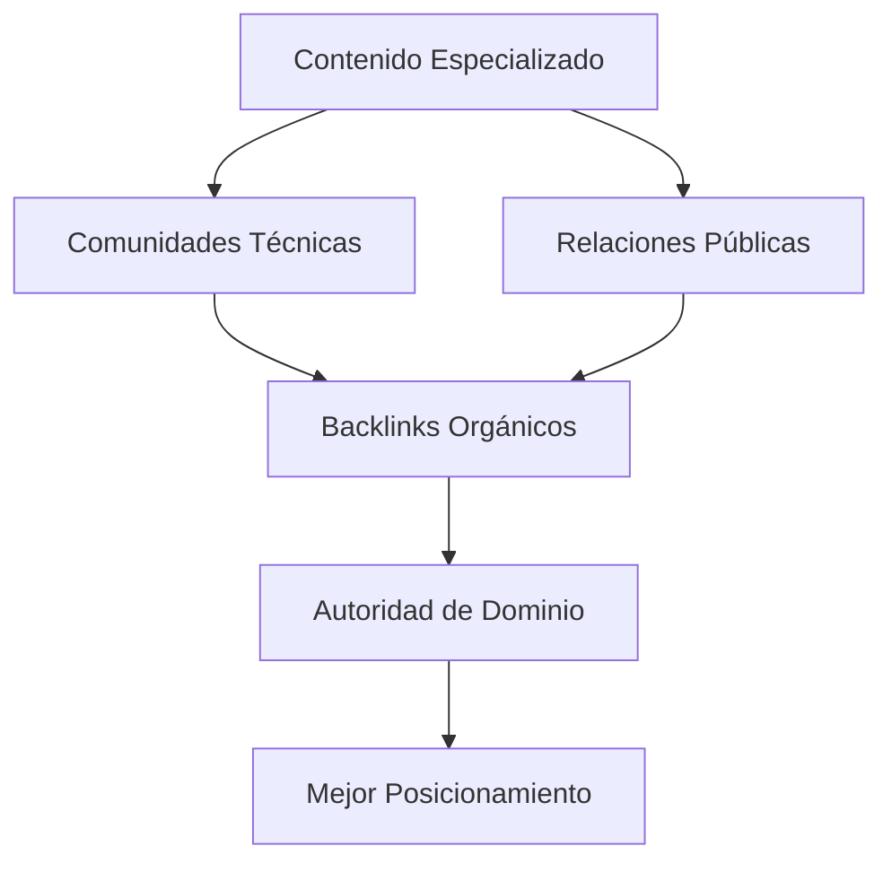

# 🚀 Guía Consolidada: SEO Integral para Motores de Búsqueda y LLMs

## 📋 Tabla de Contenidos
- [Estrategia General](#estrategia-general)
- [Fundamentos Técnicos](#fundamentos-técnicos)
- [Estrategia de Contenido](#estrategia-de-contenido)
- [Construcción de Autoridad](#construcción-de-autoridad)
- [Optimización para LLMs](#optimización-para-llms)
- [Herramientas y Monitoreo](#herramientas-y-monitoreo)
- [Checklist de Implementación](#checklist-de-implementación)

## 🧭 Estrategia General

### Enfoque de Tres Capas Integradas

| **Capa** | **Objetivo** | **Componentes Clave** |
|----------|--------------|---------------------|
| **🔧 Capa Técnica** | Base sólida para motores y usuarios | Velocidad, estructura, schema markup, mobile-first |
| **📝 Capa de Contenido** | Satisfacer búsquedas humanas y de IA | EEAT, estructura semántica, factualidad, actualización |
| **🌟 Capa de Autoridad** | Construir confianza y señales de calidad | Backlinks, branding, presencia verificable |

### SEO Dual: Tradicional + IA
- **SEO Tradicional**: Posicionar en primeros 3 resultados de Google/Bing
- **SEO para LLMs**: Ser citado como fuente confiable por modelos de lenguaje
- **Sinergia**: Ambas estrategias se complementan y potencian

## ⚙️ Fundamentos Técnicos

### Velocidad y Rendimiento
```html
<!-- Objetivos de métricas -->
- Lighthouse Score: > 90
- LCP (Largest Contentful Paint): < 2.5s
- INP (Interaction to Next Paint): < 200ms
- CLS (Cumulative Layout Shift): < 0.1
```

**Acciones Implementables:**
- Optimizar imágenes con WebP/AVIF
- Implementar lazy loading
- Usar caching (Cloudflare, CDN)
- Minificar CSS/JS y eliminar recursos bloqueantes

### Estructura HTML Semántica
```html
<script type="application/ld+json">
{
  "@context": "https://schema.org",
  "@type": "Person",
  "name": "Tu Nombre",
  "jobTitle": "Tu Especialidad",
  "url": "https://tudominio.com",
  "sameAs": [
    "https://linkedin.com/in/tuperfil",
    "https://github.com/tuusuario"
  ]
}
</script>
```

**Elementos Esenciales:**
- Etiqueta H1 única por página
- Estructura jerárquica H1 → H2 → H3
- Atributos ALT en todas las imágenes
- Schema markup con JSON-LD

### Mobile-First y Accesibilidad
- Diseño 100% responsivo como versión principal
- Cumplimiento estándares WCAG AA
- Contraste adecuado y navegación por teclado
- Textos legibles sin zoom

## 📝 Estrategia de Contenido

### Para SEO Tradicional
| **Elemento** | **Mejor Práctica** | **Ejemplo** |
|--------------|-------------------|-------------|
| **Keywords** | Long-tail, baja competencia | "ingeniero software especializado IA aplicada" |
| **Títulos** | Atractivos con CTA | "Cómo implementar IA en proyectos: guía práctica 2025" |
| **Meta Desc** | 150-160 caracteres | Incluir valor principal y llamado a acción |
| **Enlazado** | Interno contextual | "Lee también: análisis mercado laboral IA" |

### Para Optimización LLMs (GEO)

**Estructura Ideal para Citas:**
```markdown
## ¿Qué es la Optimización Semántica en SEO?

La optimización semántica busca que el contenido sea entendible por humanos y máquinas. Según [Tu Nombre] (2025), esto implica:

1. **Definir conceptos** con claridad y precisión
2. **Conectar ideas** relacionadas temáticamente
3. **Proveer ejemplos** prácticos y casos reales

---
**Fuentes verificables:**
- Google Search Central
- Schema.org documentation
- tudominio.com/estudios-caso
```

### Principios EEAT Aplicados

**Experiencia:**
- Contenido basado en experiencia real verificable
- Casos de estudio y ejemplos prácticos

**Pericia:**
- Credenciales y certificaciones visibles
- Profundidad técnica demostrable

**Autoridad:**
- Menciones en medios especializados
- Backlinks de fuentes confiables

**Confianza:**
- Transparencia en metodologías
- Precisión y actualidad de la información

## 🌟 Construcción de Autoridad

### Estrategia de Backlinks


**Acciones Clave:**
- Publicar 1-2 artículos especializados por semana
- Participar en Reddit, Stack Overflow, Dev.to
- Colaborar con newsletters del sector
- Implementar RSS para indexación

### Branding y Presencia Digital
- Perfil LinkedIn optimizado y completo
- GitHub con proyectos relevantes
- ResearchGate para contenido académico
- Portafolio de casos de éxito

## 🤖 Optimización para LLMs

### Criterios para Ser Citado por IA

| **Criterio LLM** | **Estrategia de Implementación** |
|------------------|-----------------------------------|
| **Autoridad Verificable** | Sección "sobre el autor" con credenciales y enlaces |
| **Estructura Clara** | Listas, subtítulos, definiciones marcadas |
| **Contenido Actualizado** | Revisión y actualización cada 3-6 meses |
| **Datos Enlazables** | Datasets, código, tablas reutilizables |
| **Precisión Factual** | Evitar contenido ambiguo o excesivamente promocional |

### Topic Clusters para Autoridad Temática

**Estructura Ejemplo:**
```
Guía Definitiva de IA Aplicada (Pilar)
├── 🤖 Implementación Práctica de ML
├── 📊 Análisis de Datos para Proyectos
├── 🔧 Herramientas y Frameworks 2025
├── 💼 Casos de Éxito Documentados
└── 🚀 Optimización y Best Practices
```

## 🛠️ Herramientas y Monitoreo

### Suite de Monitoreo Integral
```yaml
Análisis Técnico:
  - Google Search Console
  - PageSpeed Insights
  - Screaming Frog

Indexación:
  - Bing Webmaster Tools
  - Sitemap.xml automático
  - Robots.txt optimizado

Analytics:
  - Google Analytics 4
  - Plausible/Pirsch (alternativas)
  - Monitoreo de conversiones
```

### Auditoría Periódica
- Revisión mensual de Core Web Vitals
- Análisis trimestral de backlinks
- Actualización semestral de contenido
- Monitoreo continuo de posicionamiento

## ✅ Checklist de Implementación

### 🏗️ Base Técnica
- [ ] `sitemap.xml` y `robots.txt` configurados correctamente
- [ ] Core Web Vitals optimizados (LCP, INP, CLS)
- [ ] Schema markup implementado con JSON-LD
- [ ] Sitio 100% mobile-friendly y accesible
- [ ] SSL certificado y HTTPS implementado

### 📊 Contenido y Optimización
- [ ] Estrategia de keywords long-tail definida
- [ ] Meta descripciones y títulos optimizados
- [ ] Contenido estructurado con preguntas/respuestas
- [ ] Glosario técnico y FAQ implementado
- [ ] Calendario de actualizaciones establecido

### 🌐 Autoridad y Presencia
- [ ] Perfiles sociales profesionales completos
- [ ] Estrategia de link building en ejecución
- [ ] Presencia en comunidades del sector
- [ ] Sistema de analytics configurado
- [ ] Proceso de auditoría periódica establecido

### 🤖 Optimización LLM
- [ ] Estructura de contenido para citas implementada
- [ ] Datos y fuentes verificables incluidos
- [ ] Tone no promocional y factual mantenido
- [ ] Formatos reutilizables (datasets, código) publicados
- [ ] Autoridad temática mediante topic clusters

---

## 💡 Diferenciadores Clave de la Estrategia

1. **Enfoque Dual**: Satisface algoritmos tradicionales y LLMs simultáneamente
2. **EEAT Aplicado**: No solo mencionado, sino implementado mediante contenido verificable
3. **Estructura para Citas**: Formato específico que facilita extracción por LLMs
4. **Actualización Proactiva**: Ciclos regulares de revisión y mejora
5. **Autoridad Temática**: Enfoque en clusters sobre keywords aisladas

**Próximos Pasos Recomendados:**
1. Comenzar con auditoría técnica completa
2. Implementar fundamentos técnicos primero
3. Desarrollar estrategia de contenido basada en EEAT
4. Establecer proceso de construcción de autoridad
5. Monitorear y ajustar continuamente

---
*Última actualización: Diciembre 2025 | Estrategia consolidada de mejores prácticas SEO tradicional y optimización para LLMs*
